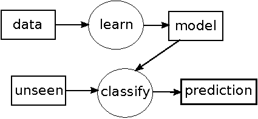
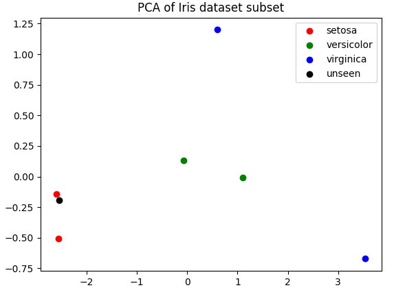
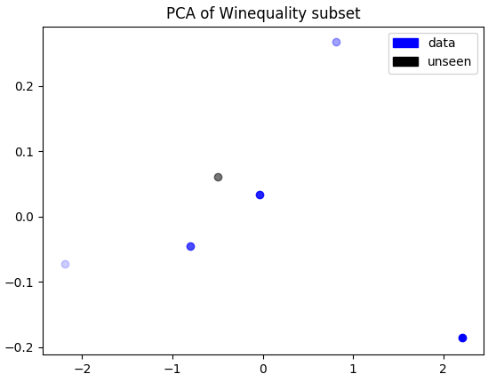

class: center, middle

## Artificial Intelligence

# Machine Learning for Games

 

Gerard Escudero & Samir Kanaan, 2019

 

.footnote[Source: [inverse](https://www.inverse.com/article/31467-artificial-intelligence-computer-human-game) ]

---
class: left, middle, inverse

# Outline

* .cyan[Introduction]

* Naïve Bayes

* Decision Trees

* Reinforcement Learning

* Genetic Algorithms

* Deep Learning

* References

---

# Classification Data Example

.center[
class      | sepal   length | sepal   width | petal   length | petal   width 
:--------- | -----: | ----: | -----: | ----: 
setosa     | 5.1    | 3.5   | 1.4    | 0.2   
setosa     | 4.9    | 3.0   | 1.4    | 0.2   
versicolor | 6.1    | 2.9   | 4.7    | 1.4   
versicolor | 5.6    | 2.9   | 3.6    | 1.3    
virginica  | 7.6    | 3.0   | 6.6    | 2.1    
virginica  | 4.9    | 2.5   | 4.5    | 1.7   
150 rows or examples (50 per class).red[*] 
]

* The .blue[class] or .blue[target] column is usually refered as vector .blue[_Y_] 

* The matrix of the rest of columns (.blue[attributes] or .blue[features]) is usually referred
as matrix .blue[_X_]

.footnote[.red[*] _Source_ : _Iris_ problem UCI repository (Frank &amp; Asunción, 2010)]

---

# Main objective

.large[Build from data a .blue[model] able to give a prediction to new .blue[unseen] examples.]

.center[]

where:
* _data = previous table_
* _unseen = [4.9, 3.1, 1.5, 0.1]_
* _prediction = "setosa"_

---

# Regression Data Example

.center[
quality | density | pH   | sulphates | alcohol
------- | ------- | ---- | --------- | -------
6       | 0.998   | 3.16 | 0.58      | 9.8
4       | 0.9948  | 3.51 | 0.43      | 11.4
8       | 0.9973  | 3.35 | 0.86      | 12.8
3       | 0.9994  | 3.16 | 0.63      | 8.4
7       | 0.99514 | 3.44 | 0.68      | 10.55
1599 examples & 12 columns (11 attributes + 1 target).red[*]
]

The main diference between classification and regression is the _Y_ or target values:

* .blue[Classification]: discrete or nominal values  
Example: _Iris_, {“setosa”, “virginica”, “versicolor”}.

* .blue[Regression]: continuous or real values  
Example: _WineQuality_, values from 0 to 10.

.footnote[.red[*] _Source_ : _wine quality_ problem from UCI repository (Frank &amp; Asunción, 2010)]
 
---

# Example method: 

#### kNN with k=1

* How can be give a prediction to next examples?

.center[
| class | sep-len | sep-wid | pet-len | pet-wid |
|:------|:--------|:--------|:--------|:--------|
| ??    | 4.9     | 3.1     | 1.5     | 0.1     |
Unseen classification example on _Iris_]

.center[
| target | density | pH   | sulphates | alcohol |
|:-------|:--------|:-----|:----------|:--------|
| ??     | 0.99546 | 3.29 | 0.54      | 10.1    |
Unseen regression example on _WineQuality_]

* Let’s begin with a representation of the problems...

---

# Classification Data Example

---

# Regression Data Example

---

# 1 Nearest Neighbors algorithm

* classification & regression

$$h(T)=y_i$$

.center[where $i = argmin_i(distance(X_i,T))$, $n=\vert features\vert$]
.center[and $distance(X,Z) = \sqrt{(x_1-z_1)^2+\ldots+(x_n-z_n)^2}$]

* Classification example (Iris):
  - distances: [0.47, 0.17, 3.66, 2.53, 6.11, 3.45]
  - prediction = setosa (0.17)

* Regression example (WineQuality):
  - distances: [0.33, 1.32, 2.72, 1.71, 0.49] 
  - prediction = 6 (0.33)

--

* .blue[lazy learning]: it means that the kNN does nothing in learning step
  - it calculates all in classify step

* This can produce some problems real time applications
  - such as .blue[Games]

---

# How about games?

#### Application examples:

- .blue[Classification]: decision about braking a car.

| Brake? | Distance | Speed |
|-------:|---------:|------:|
| Y      | 2.4      | 11.3  |
| Y      | 3.2      | 70.2  |
| N      | 75.7     | 72.7  |
| N      | 2.8      | 15.2  |
| %?     | 79.2     | 12.1  |
.center[Source: (Millington, 2019)]

- .blue[Regression]: required amount of force in a curve.

---

# Some categories

#### When?

- .blue[Online]: learn as playing

- .blue[Offline]: learn from saved matches

#### What?

- .blue[Intra-Behaviour]: atomic behaviour 
  - Example: previous examples of braking or curves

- .blue[Inter-Behaviour]: learns Decision Taking layer
  - Example: [SC2LE(StarCraft II Learning Environment)](https://arxiv.org/abs/1708.04782)

---

# Decision Learning

- A basic application is learning .blue[decisions] from .blue[observations]

  - _decisions_ will become _classes_ ($Y$)

  - _observations_ will become _features_ ($X$)

- Some kind of measure is needed to evaluate the model
 
- .blue[The Balance of Effort]

  - Many times is harder learning than human dessign (such as Behaviour Tree)

---

# Action Prediction

- It is a simple technique that tries to guess player movements from previous recordings

- Human behaviour is not random

- It is also called RPS from: rock-paper-scissor game

- Example for a simple RPS:
  - Movement: Left, Right
  - Recording: "LRRLRLLL"

- It requires a window size
  - Example: previous 3 movements

- It can produce unbeatable AIs
  - Some level adjustment would be needed

---
class: left, middle, inverse

# Outline

* .brown[Introduction]

* .cyan[Naïve Bayes]

* Decision Trees

* Reinforcement Learning

* Genetic Algorithms

* Deep Learning

* References

---

# Maximum likelihood estimation

| class      | cap-shape | cap-color | gill-size | gill-color |
|:-----------|:----------|:----------|:----------|:-----------|
| poisonous  | convex    | brown     | narrow    | black      |
| edible     | convex    | yellow    | broad     | black      |
| edible     | bell      | white     | broad     | brown      |
| poisonous  | convex    | white     | narrow    | brown      |
| edible     | convex    | yellow    | broad     | brown      |
| edible     | bell      | white     | broad     | brown      |
| poisonous  | convex    | white     | narrow    | pink       |
.center[up to 8 124 examples & 22 attributes .red[*]]

- What is $P(poisonous)$?

$$P(poisonous)=\frac{N(poisonous)}{N}=\frac{3}{7}\approx 0.429$$

.footnote[.red[*]  _Source_ : _Mushroom_ problem from UCI repository (Frank &amp; Asunción, 2010)]

---

# Naïve Bayes

#### Learning Model

$$\text{model}=[P(y)\simeq\frac{N(y)}{N},P(x_i|y)\simeq\frac{N(x_i|y)}{N(y)};\forall y \forall x_i]$$

.col5050[
.col1[
| $y$       | $P(y)$ |
|:----------|-------:|
| poisonous | 0.429  |
| edible    | 0.571  |
]
.col2[
| attr:value       | poisonous | edible |
|:-----------------|----------:|-------:|
| cap-shape:convex | 1         | 0.5    |
| cap-shape:bell   | 0         | 0.5    |
| cap-color:brown  | 0.33      | 0      |
| cap-color:yellow | 0         | 0.5    |
| cap-color:white  | 0.67      | 0.5    |
| gill-size:narrow | 1         | 0      |
| gill-size:broad  | 0         | 1      |
| gill-color:black | 0.33      | 0.25   |
| gill-color:brown | 0.33      | 0.75   |
| gill-color:pink  | 0.33      | 0      |
]
]

---

# Naïve Bayes

#### Classification

$$h(T) \approx argmax_y P(y)\cdot P(t_1|y)\cdot\ldots\cdot P(t_n|y)$$

- Test example $T$:

| class | cap-shape | cap-color | gill-size | gill-color |
|:------|:----------|:----------|:----------|:-----------|
| ??    | convex    | brown     | narrow    | black      |

- Numbers:
$$P(poisonous|T) = 0.429 \cdot 1 \cdot 0.33 \cdot 1 \cdot 0.33 = 0.047$$
$$P(edible|T) = 0.571 \cdot 0.5 \cdot 0 \cdot 0 \cdot 0.25 = 0$$
- Prediction: $$h(T) = poisonous$$

---

# Naïve Bayes

#### Notes

- It needs a smoothing technique to avoid zero counts  
  - Example: Laplace
$$P(x_i|y)\approx\frac{N(x_i|y)+1}{N(y)+N}$$

- It is empiricaly a decent classifier but a bad estimator
  - This means that $P(y|T)$ is not a good probability 

#### Implementation

- Implementation in C#
  - [view](codes/naiveBayes.html).red[*] / [output](codes/modelNB.txt) / [download code](codes/naiveBayes.cs)

.footnote[.red[*] Formated with http://hilite.me/]

---

# Gaussian Naïve Bayes

---

DTs i Gini

---
class: left, middle, inverse

# Outline

* .brown[Introduction]

* .brown[Naïve Bayes]

* .brown[Decision Trees]

* .cyan[Reinforcement Learning]

* Genetic Algorithms

* Deep Learning

* References

---

PAC3 del Samir i llibre UOC

---
class: left, middle, inverse

# Outline

* .brown[Introduction]

* .brown[Naïve Bayes]

* .brown[Decision Trees]

* .brown[Reinforcement Learning]

* .cyan[Genetic Algorithms]

* Deep Learning

* References

---

llibre uoc i transpes iaae

- Ús: ajust de paràmetres i de nivells

---

# Parameter Modification

- We have lots of magic numbers in our AI so far, remember steering ?

- How we could have a process to automatically generate the best setup ?

- We could train offline the AI in different setup and evaluate the results

- First we need a fitness value: a heuristic on how well it performs

-  E.g. we randomly setup the vectors and have the AI go from A to B
  - Fitness value could be time to target, distance taken, damage from collisions, etc.

- We can have the game run several hundreds of time

- This produce some statistics ...

- We try to not go fully random but improve the search with inform decisions

- We use a technique called hill climbing: we keep exploring what looks like the
best fitness / lower energy

2 gràfiques

---
class: left, middle, inverse

# Outline

* .brown[Introduction]

* .brown[Naïve Bayes]

* .brown[Decision Trees]

* .brown[Reinforcement Learning]

* .brown[Genetic Algorithms]

* .cyan[Deep Learning]

* References

---

kk

overfitting o teoria de l'aprenentatge

---
class: left, middle, inverse

# Outline

* .brown[Introduction]

* .brown[Naïve Bayes]

* .brown[Decision Trees]

* .brown[Reinforcement Learning]

* .brown[Genetic Algorithms]

* .brown[Deep Learning]

* .cyan[References]

---

# References

- Ian Millington. _AI for Games_ (3rd edition). CRC Press, 2019.

- Gerard Escudero. _Supervised Machine Learning_. 2019. 
  * [available online](https://gebakx.github.io/classification/slides/machineLearning.pdf)

